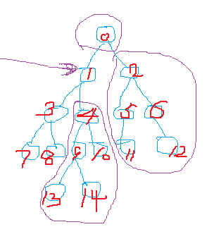

# 12.二叉搜索树

一颗二叉树，如果对于每一个节点，其左边的节点树上的值都比它小（当然可以包括等于的情况）,并且其右边的节点数上的值都比它大，那就是一颗二叉搜索树

对于一堆数据，可以有很多种不同的二叉搜索树的表示，但是应该尽量让其高度小一些，处理起来才更有效。

## 中序遍历（inorder tree walk）
中序遍历的结果就是将一颗二叉搜索树按照从小到大的顺序，有序的输出

```
function inorder_tree_walk(root) {
  if (root == nil) {
    return
  }

  inorder_tree_walk(root.left)
  print(root)
  inorder_tree_walk(root.right)
}
```

## 查询二叉搜索树
就是给定一棵二叉搜索树，和一个值，查一下这个值是不是在这个树上

```
// 传入的树，必须是棵二叉搜索树才可以。所以其实问题最关键的是如何构建一棵二叉搜索树
function tree_search(root, value) {
  if (root == nil) {  // 如果没有一颗真的树，那当然就找不到了
    return nil
  }
  if (root.value == value) {  // 如果直接相等，那就直接返回这个节点就可以了。这里有个问题要注意：[5,5,5]这3个树也能构成一个二叉搜索树，完全满足条件，去search(5)的时候，真的就是看5到底在不在这个树上，而不是说找出5的所有位置。只是找出一个位置好交差罢了。
    return root
  } else if (root.value < value) {  // 如果root的值比查找的值小，那么就要去root的右树上找
    tree_search(root.right, value)
  } else {  // 如果root的值比查找的值大，那么就要去root的左树上找
    tree_search(root.left, value)
  }
}
```

上面是不断递归的方式，下面也可以用迭代去做

```
function iterative_tree_search(root, value) {
  while(root != nil &&　root.value != value) {
    if (root.value < value ) {
      root = root.right
    } else {
      root = root.left
    }
  }
  return root
}
```


### 前驱和后继

节点的后继，就是在二叉搜索树中，比节点x的值大，但是又最靠近它的下一个
节点的前驱，就是比节点x的值小，但是又最靠近它的前一个

#### 后继



以节点1为例，它有右树。
1.根据二叉搜索树的性质，1的左树比它小，不符合后继的要求，可以直接不考虑了
2.节点1的右树，父节点，父节点的右树，都比节点1大。但是1的右数也在1的父节点的左树里，所以1的父节点肯定比1的右树大。父节点的右树就更比1的右树大了
3.所以，节点1的后继就出在1的右树里，只要找出1的右树里值最小的节点就可以了

如果节点没有右树呢？以节点10为例
1.节点10没有右树，不能按照上面的方式找。当然也不可能在节点10的左树上。
2.那就沿着树往上找，到了节点4，4也肯定小于10
3.那就再往上找，到了节点1，1还是小于10
4.再晚上找，到了节点0，0比10大，且在0右边的都比0还大，所以0就是后继。
上面的查找，只要找到第一个不再是右节点的就可以了

```
function tree_successor(x) {
  if (x.right != nil) {
    tree_minimum(x.right)
  } else {
    while(true) {
      y = x.parent
      if (y == nil) {
        return nil  // 对不起那真的找不到
      }

      if (x == y.right) {
        x = y
        y = y.parent
      } else if (x == y.left) {  // 找到了
        return y
      }
    }
    
  }
}
```

```
function tree_minimum(x) {
  var node = x
  while(node != nil) {
    node = node.left
  }
  return node
}
```

```
function tree_maxmium(x) {
  var node = x
  while(node != nil) {
    node = node.right
  }
  return node
}
```

#### 二叉搜索树插入和删除

##### 插入
```
将一个新的节点 v，插入到一棵二叉搜索树 T 中

1.如果 T是空树，那就直接指向新节点就行。
T.root = V
2.如果 T不是空树
x = T.root
while(x != nil) {
  y = x
  if (x.value > v.value) {  //去x的左支找
    x = x.left
  } else {  // 去找x的右支
    x = x.right
  }
}

// 最后跳出while时，x就是nil，而y指向最后一个节点，那接下来就是比较节点 y的值跟节点 v的值

v.parent = v
if (y.value > v.value) { // y的值比v的值大，那v就是y的左子
  y.left = v
} else {  // v是 y的右子
  y.right = v
}
```
##### 删除

```
从一棵二叉搜索树 T 中删除一个节点 v。这个问题稍微复杂些，要考虑不同情况

1.如果树是空的，那直接返回，这种情况是错误的，不需要考虑了
2.如果节点 v 没有左节点和右节点，那么就直接删掉 v 就行。只要更改 v的父节点的节点指向就行
if (v.left == nil && v.right == nil) {
  parent = v.parent
  if (parent == nil) {  // v就是根节点了
    root = nil // 把根节点删掉，树就空了
  } else {
    if (parent.left == v) { // v是父亲的左儿子
      parent.left = nil
    } else {  //v是父亲的右儿子
      parent.right = nil
    }
  }
}
3.如果节点 v 有左儿子，但是没有右儿子，以下图3号节点为例。
3的左数和右边部分之间是满足二叉搜索树的条件的，移除3后，只要用3的左儿子7来代替3的位置就可以了

if (v.left != nil && v.right == nil) {
  left = v.left
  parent = v.parent
  if (parent == nil) { // v是根节点
    left.parent = nil
    root = v.left
  } else {
    left.parent = parent
    parent.left = left
  }
}
```

```
4.如果节点 v 有右儿子，但是没有左儿子.以下图节点4为例

其父节点剩下的其他节点和整个树的右边部分再加上它右儿子树，整体都满足二叉搜索树的条件。
只要将v的右儿子替换v就可以了

if (v.left == nil && v.right != nil) {
  parent = v.parent
  right = v.right
  if (parent == nil) { // 跟上面情况类似，这里不写了
    .....
  } else {
    right.parent = parent
    if (v is parent.left) {
      parent.left  = right
    } else {
      parent.right = right
    }
  }
}
```


```
5.如果v既有左儿子又有右儿子，那就麻烦一点了。看下图解释
```


#### 如何构建一棵二叉搜索树

有一个简单方法：一个数组A，构建一个对应的二叉搜索树，其实只要每次从数组里拿出一个数字，然后调用二叉搜索树的插入就可以最后得到一个二叉搜索树。

但是这样构建的树性能怎么样？尽量分散了吗？不好说。
比如，一个已经排好序的数组，按照这方法，最后的树就是一根直溜溜的往左或者往右了，树的高度就是
A.length-1,但这样的树明显不好。

对于一个元素出现随机的数组，效果应该还行。但是对于排序好的数组，那就完蛋。对于排序好的数组，是不是可以每次随机一个索引，然后拿索引对应的值插入呢？