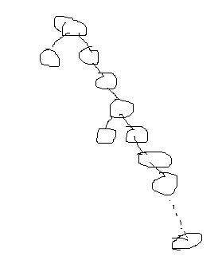
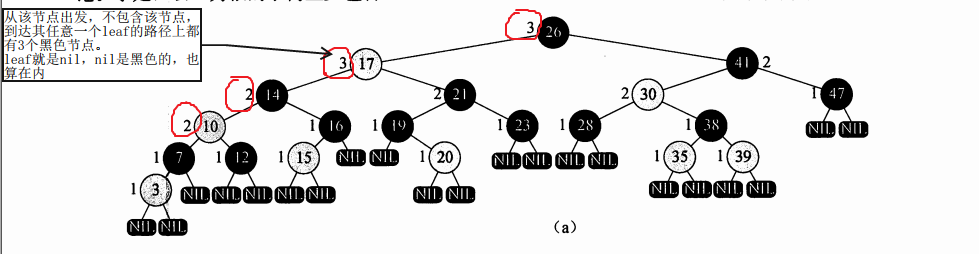
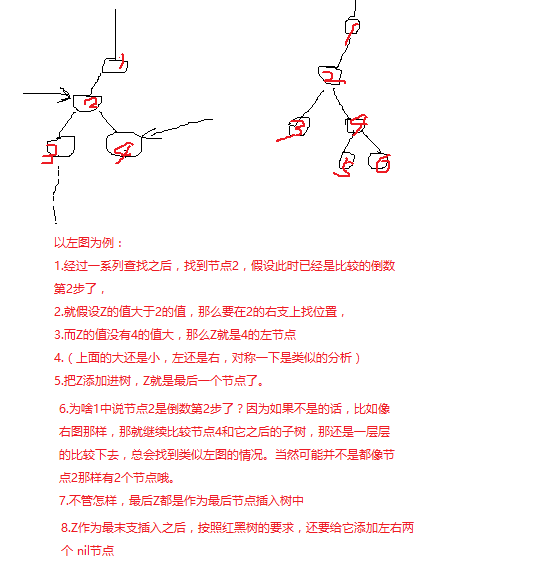
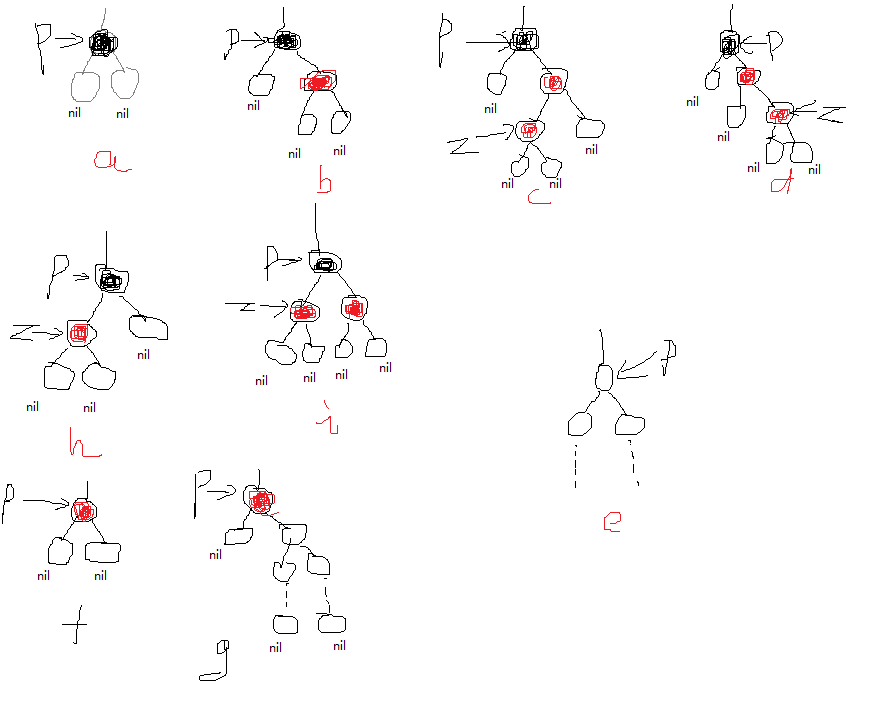
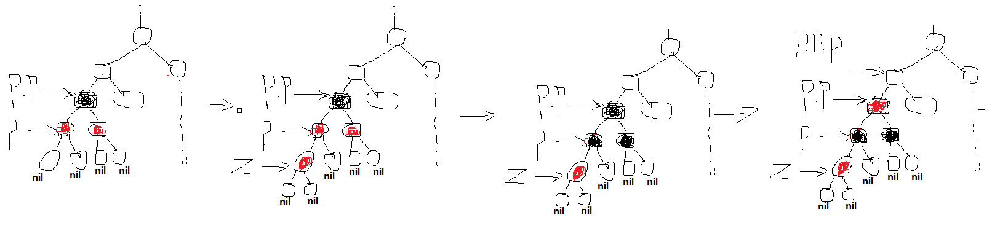
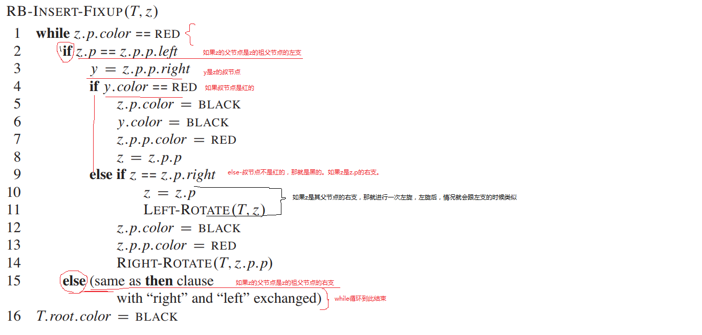

# 红黑树

一棵满足特殊要求的二叉搜索树（也叫二叉查找树，都一样）。

在构建二叉搜索树的时候，有一个显而易见的问题，就是如果构建的树深度太深，大部分的元素值都已经快在一条线性链了，那其查找的性能就会差很多。所以构建一棵较平衡的二叉搜索树就变得很重要，也就有了红黑树。

一棵很差的二叉查找树示例：  

### 红黑树的性质：

1. 树中节点要么是黑色，要么是红色
2. 树的根节点是黑色
3. 如果一个节点是红的，那它的两个子节点就是黑的。也就是说，树中父节点和其任意一个子节点，不能连续为红色。（虽然不能连续是红色，但可以连续是黑色）
4. 一棵树总归会有最后的叶子节点，但红黑树我们扩展了一下树，在“原来的叶子节点”上，给它补齐左右两个“子节点”，我们叫 nil节点。nil节点是黑色的。（比如我们选择的是一个黑色的节点，计算这个节点它的路径上的黑节点个数时，是不算它自己本身的，别误会。）
5. 一个节点Z，从它子节点开始到它子树的最终的 nil节点，每一条这样的路径上，其黑色节点数量都是相同的。  

> nil节点虽然是添加的辅助节点，但它也有颜色，是黑色的。  
> 在计算某个节点子树的路径上黑色节点数量时，nil节点是算在内的。
> 在构建的红黑树内，所有的节点，都有两个子节点，不足的用 nil节点去补足

> 有的地方，把树原来的真实节点叫树的内部节点，把加上去做辅助作用的 nil节点叫外部节点，我反正觉得没啥特大的意义，添加那么多概念干嘛呢。
> 我习惯把添加的 nil节点叫做叶子，不是叶子节点啊，这个注意

### 操作：

#### 旋转

#### 插入

往一棵红黑树里插入一个新的节点 Z  
先按照类似二叉查找树的方式找出要插入的位置。  
然后把插入的节点颜色设置为红色。但这样就有可能违背性质2或者性质4，所以后续要有一个修正的步骤。  

插入的新节点结构一定是一个Z节点再加它的左和右子节点，并且两个子节点都是 nil节点。

> 为啥会是Z节点和两个 nil节点？  
> 因为按照二叉搜索树的插入方法，新插入的节点Z，它的位置一定是原来树的“最末支”。

  
上图只是按照二叉搜索树的要求去找个位置插入Z，但这样子并不能保证满足红黑树的性质。必须对Z进行修正。  

#### 如何修正插入的Z节点？？

红黑树的修正，我们基于几个简单的前提：  
1. 原树本来就是棵红黑树，这一点肯定能保证，不然就不叫红黑树的插入了。  
	- 既然是棵红黑树，那就是说树遵守红黑树的性质，这一点非常重要  
2. 既然是棵红黑树，那么树中所有的节点都有两个子节点，没有的用nil节点补齐。当然，nil节点是没有后续节点的。

基于以上的前提，我们开始分析红黑树如何修正节点  
1. 如果插入后，节点z是根节点  

	- 就是说，在z节点插入之前，树是空的，这种情况简单，只要把z的颜色改成黑色，就满足所有的要求了。  

2. 如果插入的是其他节点  

2.1 假设z节点的父节点p是黑色的，那么就会有下面这几种情况：

2.1.1 如图a，p 在原树里是末支节点了，两个节点都是nil节点，只要找到z是左还是右就可以了，插入z后就满足要求  

2.1.2 如果p的两个节点不都是nil节点

(1)假设有一个nil节点，分析左还是右是一样的。

假设左节点是nil，右节点不是。  
根据条件5得到，p的黑节点数是1，因为只有一个nil节点，那么p的右支也要是1个黑节点才行。而不管怎样，右边节点树最后肯定有nil节点，它是黑的，所以中间不能再有黑的节点，不然就超过1个了。那就得出中间节点应该都是红色的，而如果都是红色的。那将违反“红色的节点孩子必须是黑色的”，所以在p的左节点是nil，而右节点不空的情况下，那就只能是图b那一种情况，p的右支其实只有一个真的节点，并且是红的，而且该节点有两个nil节点

在上面分析出只能是图b这种情况下：

（1.a）假设z插入的是p的左支，那就是简单的插入就可以了，插入后满足所有条件。
（1.b）假设z插入的是p的右支，那就是c和d两种情况，这两种情况下，虽然能保持条件5仍能成立，但是违反了“不能有两个连续的红色节点”，需要继续做出修正

(2)假设一个nil节点都没有，就是有两个真实的节点，像图e那样

在这种情况下，z节点的位置应该沿着某条路径继续往下找的，就跟z节点插入的父节点是p节点矛盾了，所以这种情况是不存在的。

> 综合（1）和（2），如果p的两个节点不都是nil节点，那就只能是有一个节点nil的情况。在这种情况下，要修正的就变成：z是红色的，它的父节点是红的，而叔叔是黑色的，且z是左支，和z是右支两种情况

2.2 假设z节点的父节点p是红色的，那么显然违反了“红色节点不能连续”这个条件，要进行修正

这种情况可以通过分析简化。

首先，我们知道，如果指定一个节点p为z插入后的父节点，那么这个p节点一定是图f或者图g那样，要么p就是末支节点，要么p还有子支，以右支为例。

图f那种状况，插入z后当然要修正，要不然就两个红的连在一起了。  

图g那种情况不存在的，为啥呢？因为说了要符合前提条件。p的黑色节点数是1，而右边肯定有nil节点，如果中间还有其他节点，不管有多少，如果还有黑的，那就不满足“路径上的黑色节点数是一样的”。既然不能是黑的，那就只能是红的，而如果是红的，那就违反了“两个红的不能连在一起”的条件  

所以问题就简化成图f那一种。而简化成这种后，p既然是红的，那p的父节点就肯定是黑的.

那p的叔叔节点呢？假设是黑的。显然p.p的黑节点个数是1，如果叔叔也是黑的，再算上最后肯定有个nil是黑的，那右边就是2，显然不符合条件，所以叔叔不可能是黑的。

> 因此我们得出结论，在这种情况下，叔叔节点只能是红色的

> 综合上面所有的分析，我们得出红黑树插入的所有情形，分为下面几种情况：
> 1. 如果插入后，Z是根节点，那么原树是空树，直接把节点涂成黑色  
> 2. 如果插入后，z的父节点是黑的，那么没有违背什么条件，啥也不做  
> 3. 如果插入后，z的父节点是红的，叔叔节点是红的  
> 4. 如果输入后，z的父节点是红的，叔叔节点是黑的，而且z节点是左儿子  
> 5. 如果输入后，z的父节点是红的，叔叔节点是黑的，而且z节点是右儿子  
> 其中1和2很简单。3，4，5需要特殊处理下

	
##### 情况3的修正

跟上面类似的分析，就取一种情况分析，其他的左和右都是类似的。

> 1. 原树
> 2. 插入z
> 3. z的父节点和叔叔节点都改成红的
> 4. z的祖父节点改成红的
  
> 如果z节点插入后，图中p节点就是z节点的父节点，且z节点的父节点跟叔叔节点都是红色的。那么，原树中p节点的父节点一定是黑色的，不然就两个红色相连了。此时p.p的黑色节点数是2，从p.p出发的每条到“终点”的路径上都有两个黑色的节点。

> 假定z插入的是p的左支（左右一样的分析）。插入后，p和z都是红色的，这违反了规则，所以要修正。

> 把z的父节点和叔叔节点都变成黑色的。只把节点变成黑色的，不会违背“两个红的不能连在一起”的要求，但是可能违背另一个要求：从一个节点出发，它的分支的路径上黑色节点数相同。以图示情况来说，在一开始的时候，p的黑色节点数是1个，p.p的黑色节点数是2个，但是现在p仍然为1个，p.p却变成了2个。那么对于p.p.p节点来说，它的左支比原来多了一个黑节点，但是它的右支没有发生变化，这就不符合要求了，所以把z的父节点和叔节点改成红色之后要继续修正。

> 那怎么修正呢？对于情况3，把当前结点（也就是Z节点）的父节点和叔叔节点都变成黑的以后，p.p.p的左支多了一个黑节点，右支没有变，那有一种方法，就是把p.p改成红色，这样子，多了个黑色的p，少了个黑色的p.p，就维持了数目不变。而把p.p改成红色之后，又可能面对同样的问题：把p.p看成当前结点，它与它的父节点，有可能都是红色的，所以while循环进入下一次判断。如果当前结点的父节点不是红的，那就已经好了，退出while循环了，红黑树插入成功了。

##### 情况4和5的修正

情况4和情况5类似，一个要左旋一个要右旋，就以4来说明：z的父节点是红的，叔叔节点是黑的，而且z节点是左儿子 

> 这次我们就不以刚插入的时候来说明了，上面的分析都是以刚插入前的初始情况分析，这次以中间某个while处理之后下一次循环的树来分析

> 插入z之前，原树就是棵红黑树，那么当到达现在的情况时，显然节点p的父节点是个黑色的。

> 以p为支点，翻转它的左右支.
	

#### 红黑树插入的伪代码

#### 构建一棵红黑树

与构建一棵二叉搜索树类似，从空树开始，每次往树里插入一个节点，插完了也就成了一棵红黑树。既是一棵红黑树，那它就是一个比较平衡的二叉查找树了，搜索性能就比较好了。
当然这在构建这棵树的过程中就要付出更多的代价了，比如更多的循环比较，节点的移动等等。

#### 删除