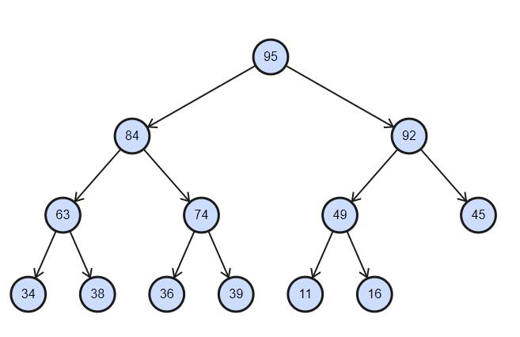

# 优先队列

## 最大堆和最小堆

首先它要是一棵**完全二叉树**，然后对于这棵树上所有的节点x，如果x都是它的子树中值最大的节点，按照这个要求获得的二叉树就叫做**最大堆**，如果x都是它的子树中值最小的节点，按照这个要求获得的二叉树就叫做**最小堆**

> 注意:最大堆和最小堆要求是完全二叉树，只是尽量排满左边的节点。它不是二叉搜索树。

上图中就是一个最大堆的例子，圆圈内的数字表示该节点的值。图中任意一个节点，它始终是比它的子树上的所有节点的值都大。

## 操作【以最大堆为例】

### 插入 insert

给定一棵最大堆的树，然后插入新的节点，要求新树仍然满足最大堆的要求

### 删除 delete

给定一棵最大堆的树，然后删除最大的节点，要求剩下的节点数仍然满足最大堆的要求。

1. 把根节点删除
2. 从原来的树中找出最后的节点，让这个节点做根节点的位置。这是为了仍然保持完全二叉树的要求
3. 将提升上来的节点跟左右两棵树比较，如果满足最大堆要求就退出（八成是不满足的，因为是从底下拿上来的，肯定比上面的值小）。如果不满足，从左右的子节点里找出最大的，跟它互换位置。
4. 重复执行3中的比较，直到把这个节点放到合适的位置

### 创建 create

给定一个数组，创建对应的最大堆的树

