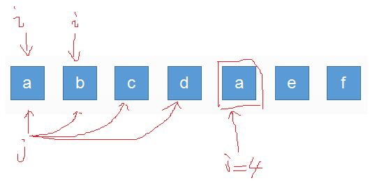

# 给定一个字符串，请你找出其中不含有重复字符的 最长子串 的长度。

假设给定一个字符串是`abcdaef`,要计算它的最长子串的长度，最直接的想法就是把这个字符串所有的子字符串像下面那样罗列出来，然后判断每一个串里有没有重复。

```
a,ab,abc,abcd,abcda,abcdae,abcdaef
b,bc,bcd,bcda,bcdae,bcdaef
c,cd,cda,cdae,cdaef
.....
.....

```

`abcda`中 a 重复了，pass 掉。`abcdae`中也是 a 重复了，pass 掉。依此类推。。。

直接遍历的方式繁重，采用`窗口思想`解决问题。

```js
var lengthOfLongestSubstring = function(s) {
  var i = 0;
  var j = 0;
  var max = 0;
  var set = new Set();
  var n = s.length;
  while (i < n && j < n) {
    var char = s[j];
    if (set.has(char) === false) {
      set.add(char);
      max = Math.max(max, j - i + 1);
      j = j + 1;
    } else {
      set.delete(s[i]);
      i = i + 1;
    }
  }
  return max;
};
```



其实对于最直接的遍历的方法，换个角度想，我们要求的就是以 a 为起点的子串最长多少，以 b 为起点的子串最长多少，以 c 为起点的子串为多少。。。

在“窗口”的方法里，i=0 时，先依次判断 j=0，1，2，3，set 里都没有重复的。当 j=4 时，检测的字符又变成了 a，这时发现 a 重复了，接下来会把 i 加 1.其实这就是算到 j=4 时，发现以 a 为起点的字符串重复了，那以 a 为开始的字符串最长就确定了。从 set 中移除最开头的字符，并且 i 变成 1 后，j 直接从上次接着来，因为在上次的判断过程中，已经确定 b c d 不重复了，那就没必要再次重新判断了，所以这个窗口的方法比直接遍历省了很多力气。
