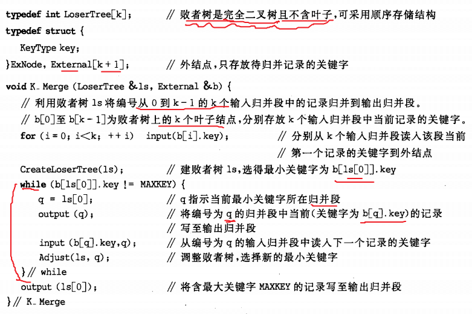
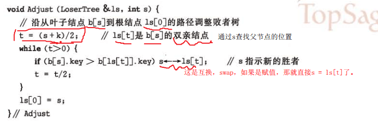
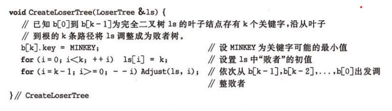
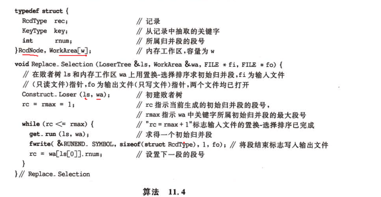
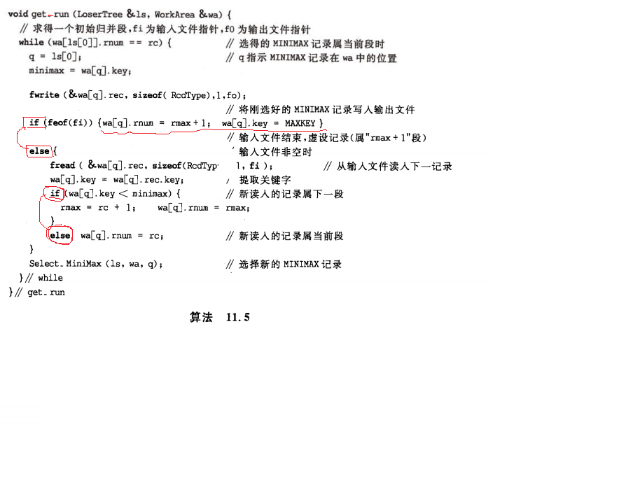
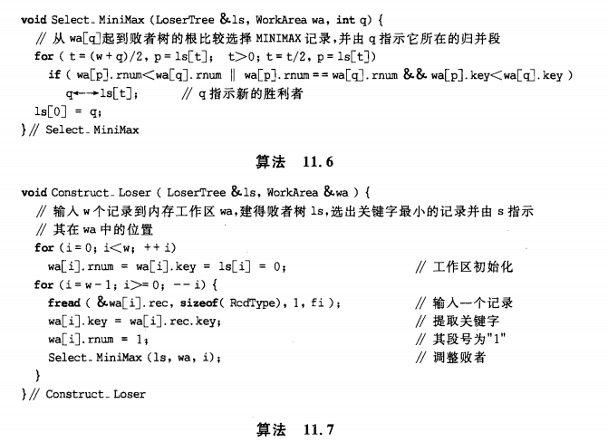
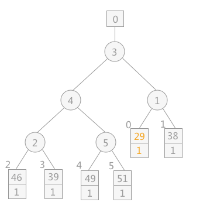
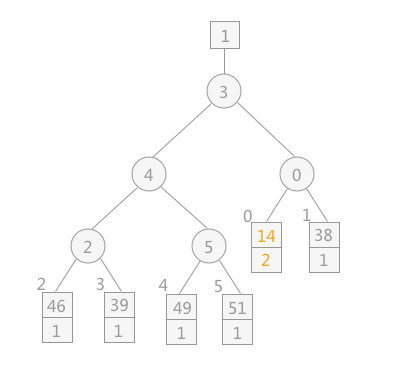

# [外部排序](http://c.biancheng.net/view/3452.html)

将数据按照条件限制来进行分块，使得每个块可以被一次性载入内存，然后对每一块内部进行排序。载入一块，排序一块，然后保存到硬盘。等所有的块都排序好后，再将这些排好序的块归并到一起，则整体有序。

对于分好的块进行排序，没什么特殊的，就是用之前的内部排序的方法。那如何进行归并呢？

对于每个块，每次读入不同块里的一个数据，这些数据组成一个待考察的集合，排序得出其中最小的（假设从小到大排序），那这个最小的就是所有数据里最小的，然后写入外部文件。写入后，再读取一个数据进来，重新将待考察集合排序后得出最小值，再次写入文件。依此类推，直到最后将所有的块的数据全部处理完，写入文件。

但这里读入和写入文件是个关键，一次读入10个数据，和一次读入1个数据，所耗时并不是10倍的关系，可能是100倍，1000倍。所以如何在内存限制的前提下减少读入和写入文件的次数成了关键。

在第一次比较时，几个数据排序好，选择出最小一个“写入文件”后，再取一个填补进来。由于前面的数据都是有序的，那填补进来后并不需要完全的重新排序，可以二分查找快速确定位置。确定位置后数字集的最前边的就是下一个要弹出的最小值。

**外部排序的关键是针对限制条件，如何确定合适的分块，已经如何从已排序好的分块里重新合出最后的排好序的整体**

归并操作对象的选取有两种方式：一是根据限制，每次选取两个归并段作为操作对象，从中读入一部分数据，然后对这部分数据进行归并，归并完后写入文件。再读一部分数据进来，执行一样的操作。处理完这俩归并段之后，再取俩归并段进行一样的操作。或者同时开启几个归并段，但是相对来说，每个段读入少量的数据，归并处理完后，写入文件。再每个归并段读入一部分数据，再进行同样的操作。针对这两种方式就出了**n-路平衡归并**的概念。

## 2-路平衡归并

**2-路平衡归并**是先分段，对每段进行段内排序。归并时，选取两段为对象，一部分一部分合并，比如 R1 和 R2 合并，R3 和 R4 合并，合并完后又得到一些归并段，再继续同样的操作，直到把所有的数据都归并起来。它的执行过程像是倒过来的二叉树一样，一层一层，段的数量不断减少，最后合成一个“根节点”，完成排序。

## 多路平衡归并

**n-路归并**意思是，在完成段内排序后，要归并成整体有序的数据，在这个归并的过程中，一次选取的归并段的数量。每次选2个就是2-路，每次选3个就是3-路，依此类推。

使用**败者树**策略进行归并。

败者树，父节点存的是左右两子节点比较之后的失败者，在这说是两个子节点中的较大的那个，谁大谁失败。因为目的是从小到大排列，所以树的根节点的父节点是个最小的，所以在中途比较时，每次比较完之后，大的数就留在那吧，小的数就上浮一层，跟其他对等位置的数比较，这样最后才能得出最小的值。

分路平衡归并时，在归并的过程中，操作的对象是已经内部有序的子段，限制条件依然是内存不足以一次性载入所有数据。那设置合理的缓冲区buffer，举例来说，假设内存限制最高200条数据，4-路合并，那就从4个子段，每段读入50个数据，总共有200个数据，内存能装得下。进入内存之后，这些数据依然有明确的标识都属于哪个段里。归并的过程中，不断的将目标从这200个数据里选出来。假定这载入内存的4块数据中有一块空了，则此次归并暂停。总有一块会先取空的。当某块取空后，此时将buffer内的数据写入文件，这些数据的大小关系是正确的，且对于整体数据来说也是正确的。然后从块里再读入一些数据，每个块读入的数据就是每个块已经写出去的数据的数量。

参考链接里，在归并的过程中，只说了将谁和谁要进行归并，但没进行怎么归并的说明，因为随着归并的操作，后面的一块数据的数据量越来越大，不可能一次性载入内存了，如何将800个数据和200个数据归并？就是我上面说的，设置buffer，减少读写的操作。

**对于同一个文件来说，对其进行外部排序时访问外存的次数同归并的次数成正比，即归并操作的次数越多，访问外存的次数就越多**

因为归并操作次数越多，说明一开始分的块越多，同样的总和数量下的数据，每块就越小，但是每块的读入依然是要一次读入操作的，那就意味着读入操作越多。

一般情况下对于具有 m 个初始归并段进行 k-路平衡归并时，归并的次数为：s=⌊logkm⌋（其中 s 表示归并次数）。

要注意：

败者树是一棵**类完全二叉树**，第0个节点是单独在根节点之上的。这棵树中叶子节点的父节点关系是 `t = (s + k) / 2`，之后在树中往上遍历时，每次都是`/2`的操作。

`adjust`方法就是对传入的要排序的数组里的`s`序号的值进行调整，使得从它往上一路满足败者树的规则。开始时的`for`循环完成后，则初始树变成了败者树。之后就可以从`[0]`处确定最小值后，在它对应的数组里引入下一位，然后从底往上修改与这一位有关的树，再次调整完后，又可以弹出一个最小的树。

**深入理解`t = (s + k) / 2`和`t = t / 2`**

## 置换-选择归并

采用不同的方法创建归并段。多路里是先将整体数据分为`n`份，对每份进行排序后，每一份都是一个归并段。置换-选择里，是一点一点按着大小去增加归并段的元素数量，找不到更大的了，就重新创建个新的归并段，然后再执行。这样最后处理完数据后，就是几个排序好的归并段，它的特点是归并段并不一定是等分数量的，有的多，有的少，很正常。

这里使用的败者树跟多路平衡里的不太一样，加入了序号的概念，先比较序号再比较数值，最后确定胜败关系。这是因为它每一次从顶部弹出一个最小值，就会在弹出的那个位置重新塞入一个数值，而下一次要查找的目标是比刚才弹出去的那个最小值更大的数中的最小值，如果不做序号保护，那压入新值之后，重新处理败者树，最后弹出的是现在所有数中的最小数，而不是比刚才弹出去的那个最小值更大的数中的最小值。

假定如图一次比较的结果，该次比较之后，最小值为序号0的数组元素，值为29。弹出后，读入下一个值来填补29的空位，假定这个新读入的值为14。如果此时不采用序号进行一下保护，则这个14会一直往上冒，最后弹出。这显然是跟算法矛盾的。所以为14添加了序号2（新读入的值，如果比弹出的值小，则为2，比弹出的值大，则为1），这样先比较序号，再比较数值，就能让最后的弹出元素满足条件。**序号小的为胜者，序号大的为败者，败者留下，胜者继续上浮一层，去更高的位置去比较。序号相同，数值小的为胜者**

## 胜者树和败者树

这个对比的概念是在跟树形选择排序时提出的。在树形选择排序的叶子里，从叶子节点开始，两两比较之后，得出两者中的最小值。然后父节点的值就设为这个最小值。然后再网上层去这么做。这样子比较完之后，最终就能在树的根节点里得出这些数中的最小值。弹出之后，将原来这个数所在的叶子结点的值改为无穷大，重新调整它涉及到的数枝，慢慢就从小到大输出了全部数字了。观察中间节点，会发现这些中间节点，它们的值是比较后的胜者（符合目的的就是胜者。例子是要从小到大，当然在一层层往上挑选的时候，应该挑出最小的数。如果换成是从大到小排序，那每次比较完之后，应该是最大的值往上冒一层。同时最后弹出一个值后，把这个值对应的叶子节点的值改为无穷小。）。

而败者树，（胜败都是看你的目的，是从小到大还是从大到小），假设从小到大排序，比较一次后，父节点保存大的值（败者），而子节点上升，去更高级去比较。

两种树还有个区别，胜者树是完全二叉树，没有多出来的根节点的顶上节点。

## 最佳归并树

通过构建**类哈夫曼树**减少数据读取的次数，提高性能。考虑的是各段内数据是排好序了，如何归并出最后的数据，在这过程中，一个是比较，一个是读写数据。败者树减少了比较的次数，最佳合并减少了对外部读写数据的次数。

---

- <h5>关于书中**11.2**对于2-路归并里，读和写的次数的计算，我想大概是这么来的：</h5>

待排序的总体数据是`10000`条，因内存限制，分为`10`个段，则每个段`1000`条记录。在硬盘里数据存储是按照块来存储的，每个块的空间能容纳`200`条记录，则对于一个段来说，要在硬盘里存`1000/200=5`个块。

**数据在硬盘里以块的形式聚合在一起，是为了提高硬盘的使用率。在这里，每次只能读入并不是读入某一个块，而是读入某一个数量受到限制的集，这个集可以正好是一个块，也可以是块的一部分，也可以是几个块**

在归并的过程中，`R1`和`R2`归并，每次**各**读入`200`条记录，共`400`条数据，就是各读入一个块的数据，那就是`2`次读入操作。合并的过程中，一定是某个段的这`200`条数据先用完，则此时需要将已经合并好的数据写入硬盘，总共多少条数据呢？假设是`200+X`条数据。那这`200+X`条数据写入硬盘，就要`2`次写入操作，因为一次只能写一个块,`200`条记录，所以只能是`2`次（那么问题就来了：为啥一次写入最多只能写入一个块的大小，`200+x`条记录要写`2`次呢？）。到此为止，一次内存中的归并，需要`2`次读入和`2`次写入。

对于已经空掉那个段（要么是`R1`，要么是`R2`），重新读入`200`条记录，而另外一个则只能读入`200-X`条记录，那么这需要`2`次读入。虽然是`200-x`条数据，仍然要`1`次读入。这样内存里就凑够了`200+200`条数据，重复上面的操作，合并后写入，那么这一步里，也是`2`次读入和`2`次写入。

继续`R1`和`R2`的剩下部分的合并，则发现，`R1`和`R2`要想完整合并好，就是`10`次读入和`10`次写入。

那么对于`10`个分组，两两进行归并，总共就要`10*5=50`次读入和`10*5=50`次写入.

> 但这里是对内存同时归并的记录数量进行了限定，每次限定各个段只读入`200`条，总共`400`条。**但如果内存限定是`800`条**，一个段可以一次读入`400`条数据，也就是2个块的数据呢？读入和写入的数量就会立马减少。很好理解，内存越大，则同时处理的数据越多，则一次读入和一次写入的数据越多，则需要处理的次数越少，则读入和写入的次数越少。

**问题的根节在于硬盘分块之后，对读和写有什么限制呢？还有一次内存能处理的数据量是要有个前提说明的，书里明显没有。**