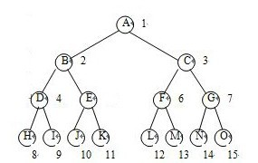
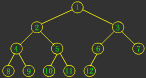
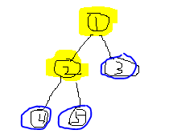
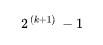
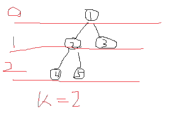

二叉树：

维基百科：https://zh.wikipedia.org/wiki/%E4%BA%8C%E5%8F%89%E6%A0%91

一个树的高度或者深度，是计算它的“长度”最长的“边”由几条“线段”组成。
下面图示的满二叉树，深度/高度为3，因为边最长只构成3条线段

满二叉树：除了最底层的叶子节点，其他所有的层上的节点，都有2个子节点的二叉树。满，就是填满，充满的意思。

完全二叉树：从对应的满二叉树里劈下一块，最后一层的节点都尽量靠左排列的二叉树。

从两个图看，满二叉树肯定是颗完全二叉树，但是完全二叉树不一定是满二叉树

关于这俩定义，还真有点疑问：网上的定义还都不一致，说分国内定义和国外定义。
有种说法叫：除了叶子节点，其余的节点都有2个子节点，这就叫满二叉树。那么如果按照这个定义来看，下面的二叉树也算个满二叉树

蓝色的节点是叶子节点，出了它们就只剩下1和2，但是剩下的节点1和2，它们是满的。那难道上面这是个满二叉树？但这个又感觉上好像并不是呀。

！！！ 上面的树不是满二叉树。满二叉树只有最后一层是叶子节点，其他层都是有2个子节点才行。
满二叉树的定义不是说“除了叶子节点，其他的节点都有2个子节点”，而是按照公示，如果一个二叉树，其深度为 K，那么其子节点个数满足下面公式,则为一个满二叉树    
  

深度或者说层数，根节点不是第1层，是第0层。

维基百科上讲： 对任何一棵非空的二叉树，如果其叶片（终端节点）数为n0，分支度为2的节点数为n2，则n0=n2+1。
针对上图，n2 肯定是2，那么由公示 n0 就肯定是 3， 所以节点3也是叶子节点才行，也就反证出，上面“满二叉树是除叶子节点外其他节点都有2个子节点的数”这个说法并不正确。

那完全二叉树其实就是，除了最后一层，其余层都是满的。上面这个图，除了第2层没有填满，还缺2个，第1层最多就放2个，满了，第0层就只能放根节点1个，也满了，所以上图是颗完全二叉树。

link：
https://medium.com/basecs/heapify-all-the-things-with-heap-sort-55ee1c93af82