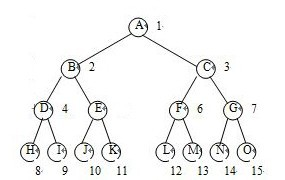
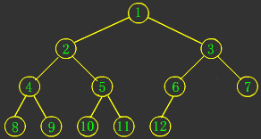
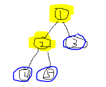
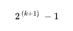
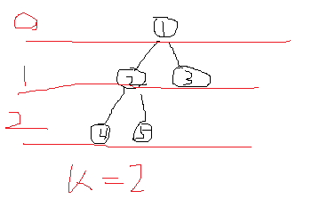
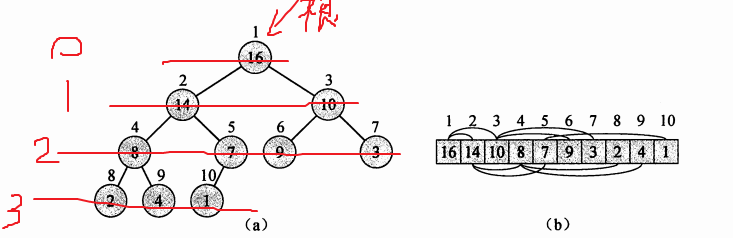
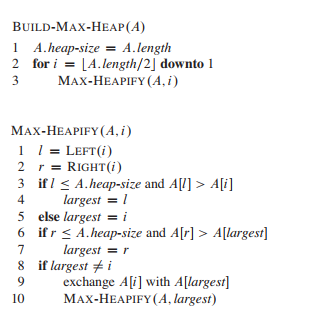
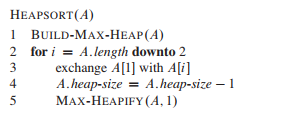

# 6.堆排序

#### 二叉树：

维基百科：https://zh.wikipedia.org/wiki/%E4%BA%8C%E5%8F%89%E6%A0%91

一个树的高度或者深度，是计算它的“长度”最长的“边”由几条“线段”组成。
下面图示的满二叉树，深度/高度为3，因为边最长只构成3条线段



满二叉树：除了最底层的叶子节点，其他所有的层上的节点，都有2个子节点的二叉树。满，就是填满，充满的意思。

完全二叉树：从对应的满二叉树里劈下一块，最后一层的节点都尽量靠左排列的二叉树。



从以上两个图很容易看出，完全二叉树就是从满二叉树中劈下来的。

~~关于这俩定义，还真有点疑问：网上的定义还都不一致，说分国内定义和国外定义。
有种说法叫：除了叶子节点，其余的节点都有2个子节点，这就叫满二叉树。那么如果按照这个定义来看，下面的二叉树也算个满二叉树.~~



~~蓝色的节点是叶子节点，除了它们就只剩下1和2，但是剩下的节点1和2，它们是满的。那难道上面这是个满二叉树？但这个又感觉上好像并不是呀。~~

上面的树不是满二叉树。**满二叉树必须只有最后一层是叶子节点，其他层都是有2个子节点才行。**
满二叉树的定义不是说“除了叶子节点，其他的节点都有2个子节点”，而是按照公式，如果一个二叉树，其深度为 K，那么其子节点个数满足下面公式,则为一个满二叉树    
  

这里公式里的 `k` 深度或者说层数，根节点不是第1层，是第0层。



维基百科上讲： 对任何一棵非空的二叉树，如果其叶片（终端节点）数为n0，分支度为2的节点数为n2，则n0=n2+1。
针对上图，n2 肯定是2，那么由公示 n0 就肯定是 3， 所以节点3也是叶子节点才行，也就反证出，上面“满二叉树是除叶子节点外其他节点都有2个子节点的数”这个说法并不正确。写教材不好好写啊。

那完全二叉树其实就是，除了最后一层，其余层都是满的。上面这个图，除了第2层没有填满，还缺2个，第1层最多就放2个，满了，第0层就只能放根节点1个，也满了，所以上图是颗完全二叉树。


link：
https://medium.com/basecs/heapify-all-the-things-with-heap-sort-55ee1c93af82

#### 堆

堆可以用完全二叉树来表示。堆排序就是一个数组A，`[a0, a1, a2,....an]`这么表示，然后从开头`a0`开始取出值，一个一个去构建一棵完全二叉树，然后对这棵完全二叉树进行排序。


下图展示了将一个数组转化成对应的完全二叉树。**图中的序号是从1开始，与实际代码中开始序号不同。**


最大的在前面就是最大堆，最小的在前面就是最小堆。

最大堆，父节点大于等于子节点的值。最小堆：父节点小于等于子节点的值。一般用的时候，不考虑等于的情况。

`max_heapify`将传入的数组，从`i`开始整理成符合最大堆原则的数组，但是有前提条件的，那就是从`i`开始剩下的那块树都已经满足左树和右数是符合原则的，并不是随便给一个`array`和`i`，都能最后构建最大堆，真正能构建最大堆是`build_max_heap`.

那怎么构建最大堆呢？

一个数组有n个元素，每个元素当做一个节点，按照完全二叉树的方式去组织这些节点的关系形成一棵树。

数组元素的`index`和其左右子节点的`index`是有明确的的关系，树中最后一个非叶子节点的`index`也有明确的公式表示。所有的叶子节点，他们没有子节点，所以他们本身就是个最大堆，所以这些节点不需要处理，只要从最后一个非叶子节点开始往前，取出局部的根节点、左子节点、右子节点，然后执行`max_heapify`，使这3者的关系满足最大堆的原则。然后依次往前知道整棵树的根节点，因为每一步之前两个子树都满足原则，处理后根节点+子树仍然满足，那处理完全部节点后，就都满足。



##### 堆排序

构建完最大堆之后，数组中最大的元素就在根部，但是此时堆只是保证在所有的局部，父节点都是比子节点大，并不能保证子节点之间的大小关系，此时数组还没有排序完。

构建完最大堆之后，把`A[0]`的值跟`A[length-1]`的值交换，那么最大的数就在最后了。但是交换后，原来最后的数就变成了根部，此时并不能保证它就是最大的。怎么处理呢？

交换后，把尾部的数从堆中去掉，然后此时问题就变成了，一个根元素，不知道是不是最大，一个满足原则的左节点树和一个右节点树，怎样处理让这些数中最大的值到达根部？

很显然，这又是 `max_heapify` 要处理的问题。

时间复杂度: `N*logN`



#### 优先级队列

利用最大堆和堆排序相关知识可以构建一个优先级队列。每个“任务”都有一个对应的优先级，每次都从队列中找出一个优先级最高的，拿出来去执行。显然这里就有两个问题要解决，一个插入新的任务，一个弹出最优先执行的任务。

```javascript
// 构建最大堆。如果array确定是已经构建好最大堆了，那 heap_maximum 直接return array[0]即可，否则就要先构建最大堆
build_max_heap(array) 
```

下面的几个方法，都要提前构建过最大堆才能用

```javascript
// 访问当前优先级最高的数据。
heap_maximum(array) {  
  return array[0]
}
```

这里只是访问当前最高优先级，而不是处理它。如果是处理它，访问的同时，还要把他从原最大堆里剔除，并保证剔除后仍然是最大堆

```javascript
heap_size = array.length

// 从数组中返回最大优先级，并重新构建好剩余的数据
function heap_extract_max(array) {
  max = array[0]  // 前面构建了最大堆，那么max = array[0]

  array[0] = array[heap_size-1] // 把 heap_size 下标的元素换到 0 处，这跟 heap_sort 是类似的

  heap_size = heap_size - 1

  max_heapify(array, 0, heap_size) // 重新构建剩余优先级的最大堆，之后最大优先级又到了 0处

  return max
}
```

弹出最大优先级，并保证剩余的符合规则，思路很简单，就是将`[0]`和`[size-1]`交换后，将身下的重新调整成最大堆。

```javascript
// 提升下标 i 的优先级，变为新的 priority。只能是提升，新的优先级比原来的高
heap_increase_priority(array, i, priority) {
  array[i] = priority // 先更新优先级
  parent = PARENT[i]  // 然后与其父节点比较
  while(i > 0) {
    if (array[parent] < priority) { // 如果优先级比父节点高，就交换值。因为之前已经构建最大堆了，所以父节点交换后跟下面的节点仍然满足最大堆要求，但是新提升的优先级不一定满足要求，所以要沿着路径递归的去比对，一直到根节点。
      exchange array[parent] with array[i]
      i = parent
    }
  }
}
```


```javascript
// 添加新的优先级数据
// 先给队列加一个负无穷的优先级，直接添加到最后，一定满足最大堆的要求，它前面的肯定比它大，毕竟是MIN_VALUE。新元素下标为 heap_size-1 
// 问题就变成了，将最后的那个优先级，提升至新加的 priority 的问题，也就是 heap_increase_priority
max_heap_insert(array, priority) {
  heap_size = heap_size + 1
  array[heap_size-1] = - infinity // MIN_VALUE
  heap_increase_priority(array, heap_size-1, priority)
}
```