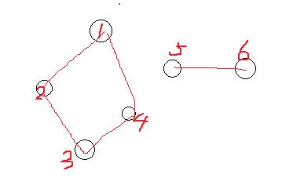

# 图

## 各种概念

- 图

用`G=(V, E)`来表示，其中 V 是一个非空有限的顶点集合，E 是一个有限的边的集合，边的两个端点都是集合 V 中的顶点。

- 无向图和有向图

如果图中的边是没方向的，就叫无向图。如果途中的边是有方向的，就叫有向图。

- 权重

图中的每条边都可以有一个值，叫权重，可以表示想要的意义。

- 网络

给定一个图`G`,它里面的边给定一个权重函数`w`(就是边会给定权重值)，这样的图也叫**网络**

- 路径

一个边的集合，使得从顶点 v 到顶点 w 连接起来，这就是一条路径。对于无权图，这个边的集合中，边的条数就是路径长度。对于有权图，这些边的权重和就是这条路径的长度。

如果顶点 v 到 w 的路径中，所有途径的顶点都不一样，称为简单路径。**一般研究的对象或者结果都是简单路径**

- 度、出度、入度

以某个顶点`v`为例，集合`E`中所有以这个点`v`为端点的边的数量叫做这个顶点`v`的度。

对于有向图，以`v`为起点的边的数量叫`v`的出度，以`v`为终点的边的数量叫`v`的入度。

- 稀疏图、稠密图、完全图

简单点说，图中的边数比较少就是**稀疏图**，边比较多就是**稠密图**。如果图中任意两点之间都有边，就是**完全图**。

- 连通、连通图、强连通、强连通图、弱连通图

在一个图中，如果顶点 i 和 j 之间有路径，就称 i 和 j 是连通的。

如果一个图中任意两个顶点间都是连通的，则称为连通图。

强连通：给定一个**有向图**G，如果其中的两个顶点`a`和`b`,存在路径从 a 到 b，从 b 到 a,则称 a 和 b 是强连通的。

强连通图：对于**有向图**G，如果任意两个顶点之间都是强连通的，则该有向图为强连通图。

弱连通图：对于**有向图**G，如果将图中的边用没有方向的边替代，则得到一个无向图，该图称为原图的**基图**。如果一个有向图的基图是连通图，则称该有向图为弱连通图。

> 判断一个图是不是弱连通图，先排除它是强连通图，然后再按照基图是否是连通图去判断。强连通图的基图必然是连通的。

- 连通分量

给定一个无向图，它的顶点集合中很可能有些点并不是连通的，也就是说有些点是孤立成一部分的。那么在这样子的无向图中，找出一个点和边的集合，使得尽最大可能将能连起来的顶点连起来，这就是连通分量（connected component）。【ps：这是我自己的解释】。

> 如果得出一个集合，图中剩下的点还可以用某条剩下的边连到这个集合中的点上，那这个集合并不是连通分量。一定要**尽最大可能**

- 强连通分量

有向图中的极大的强连通子图就是强连通分量。

> 尽最大可能找出来的子图，只是对于找出来的那个集合来说的，并不是针对原图的大小来说的。在下面的例子中，图中有 6 个顶点，其中顶点 1234 组成一个连通分量，顶点 56 组成一个连通分量，因为这俩集合都尽最大努力去连接其他顶点了，不能因为 56 只连接了 2 个顶点，而 1234 连接了 4 个就说 56 不是。它们都是。

## 图的表示方法

- 邻接矩阵

对于一个普通的图，是一个矩阵，`A[i][j]`表示矩阵中的`i`行`j`列，分别对应顶点`i`和顶点`j`，如果`A[i][j]`为`1`，则表示`i`和`j`之间有边，否则`i`和`j`之间没有边。

如果是对于网络，可以将`A[i][j]`记成对应的顶点之间边的权重。

- 邻接表

从每个顶点出发，都对应创建一个链表，表头就是这个顶点，链表上的其余元素就是这个顶点的邻接点（跟这个顶点有边直接连起来的顶点）。

> 这里一般都用邻接链表来表示一个图

> 图的表示有很多种，此处的两种是常见的两种方法。

## 常见问题和应用

- [广度优先搜索（BFS）](./广度优先搜索.md)

- [深度优先搜索（DFS）](./深度优先搜索.md)

- [最小生成树问题](./最小生成树问题.md)

给定一个图，想找到这么一个顶点`V`和边`E`的集合，这个集合使得给定图中任意的两个顶点，都有路径可以从一点到达另一点，并且这个集合的**边的权重和是最小**的。

- [最短路径问题](./最短路径问题.md)

在网络中，求两个不同顶点之间的所有路径中，边的权值和最小的那条路径。
