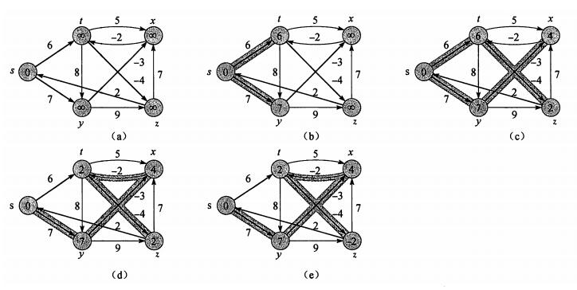
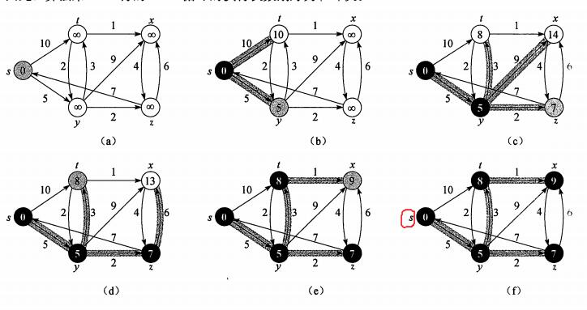

# 最短路径问题

## 单源最短路径问题

给定一个图 G = (V, E),找出从给定的顶点 s 出发到其他顶点的最短路径。

顶点 s 到顶点 v 的最短路径是指在从 s 到 v 的所有路径中，路径的权重和最小的那条路径。

> 最短路径不一定是唯一的，可以有多条。

> 对于最短路径上经过的点，这些点之间的这部分路径，也是这些点之间的一条最短路径。

> 权重只是个衡量值，可以是很多有具体意义的值，比如花费的钱、经过的路程、消耗的时间等。

### Bellman-Ford 算法

**节点的前继节点用 π 表示实在是难理解，可以直接用 parent 代替**

算法第 `1` 行先对所有的点进行设置。此时还没有找路径，所以每个点它的路径的权重都是**无穷大**。前继节点也是 null，因为还没找啊。

> 前继节点类似父节点，因为算法最后找到的最短路径，其实不是一条路径，而是一个最短路径的树：树的根节点就是源节点，表示从源节点出发。树中其他的节点表示从根节点可以到达的节点，而树中的边就是图中边。给定一个顶点，在这个树上找到它，然后从源点出发，沿着树走，经过的点和边就构成源点和目标点之间的最短路径。

算法第 `5-8` 行是对遍历结果进行验证，判断是否能找到合适的最短路径，也就是排除某条路径中出现部分权重和为负值的环路。一旦有几条边构成了权重和为负值的环路，那么只要沿着这个环路走下去，权重和就会一直变小，那就陷入了死循环，对最短路径问题也就没啥意义了，所以此时我们认为找不到最短路径。

> 判断的依据是三角不等式性质。这个性质也很好证明，采用反证法。假设给定一个图 `G` 和源点 `s`，已经计算好最短路径。对于任意节点 `u` 和 `v`，`v.d > u.d + w(u,v)`。假设这个结论成立，那么说明有一条从 `s` 先到 `u` 然后从 `u` 到 ``v` 的路径，这条路径的权重比已经计算出来的 `v.d` 还小，那到 `v` 的最短路径应该是经过 `u` 到达 `v`，而不是当前 `v` 的那条最短路径，这与最短路径定义矛盾。

`RELAX` 操作是说，对于 `v` 的权重和 `v.d`，假如有一条路径，它经过点 `u`，然后从 `u` 到达 `v`，这条路径的权重和为 `u.d+w(u,v)`,如果 `v.d > u.d + w(u,v)`，说明可以找一条到 `v` 的更短的路径，所以更新 `v.d` 和 `v.parent`。

第 `2-4` 行遍历执行 `RELAX` 操作。这里有一点很重要：比如遍历时候遇到一条边`(u,v)`，在判断 `v.d` 和 `u.d`，`w(u,v)`的时候发现此时 `u.d` 还没明确计算出值来，那怎么比较，无穷大跟无穷大比？放心，此时无穷大跟无穷大比，是不会满足大于的关系的，也就不会走入那个 if 判断内部。

**这样做为啥结果就是能找出路径呢？**

其实这个算法，遍历一次，就是找出路径长度(或者叫深度，因为图也可以看成是树)为1的可能路径，遍历两次，，就找出路径长度为2的可能路径。以此类推，遍历v-1次，就是找出路径长度为v-1的可能路径。这里要注意两点，一是总共遍历`v-1`次，二是每次遍历的结果是**可能**.

在中间的每次循环过程中，很有可能不光没找到从 `s` 到 `v` 的最短路径，甚至都没找到一条能走的路径，所以只能是可能。比如第一次遍历，对所有边进行判断时，有可能是按照从离 `s` 近到远的顺序去处理节点，这样的话，经过这次循环，每个节点就有了当下的 `d` 值（不再是无穷大了）和前驱节点，因为每一个节点都是依赖上一层深度的节点来走，所以从近往外之后所有点都能找到一条路径。但是更大的可能是不按照这个顺序来，是无效的，比如先遍历离 `s` 很远的节点，再遍历近的。对于远的那些节点，`u` 和 `v` 的 `d` 值和前驱节点都是初始化时的无穷大和null，根本没法有效比较，也就继续维持现状，还是无穷大和null。那在这种情况下，这第一次遍历只能保证离 `s` 最近，也就是图上跟 `s` 能直接接触的点（深度为1），才能进行 `s.d` 和 `v.d` 的有效比较，从而更新 `v.d` 和 `v` 的前驱节点。这就是上面说的，先路径长度为1的可能路径，再是2的，再是3的，，，最后是v-1的。因为在每次的遍历中，全部的边都会重新更新一次，所以最后得到的值就是期望的最短路径权重，从后往前，就能找到那条期望的路径。

之所以是遍历 `v-1` 次 ，是因为全图的节点数是 `v` ,则从源点 `s` 到节点 `v` 的最长可能的路径长度就是 `v-1`（是路径长度，路径上节点的个数，不是路径的权重和），所以要查路径长度为 `1` 到 `v-1` 的可能。

#### Bellman-Ford 的例子

图中 a 是初始状态。

根据算法 3-4，`for each edge (u,v) { RELAX(u,v,w) }`，遍历这些边的时候是没有确定的顺序的，比如用邻接表来表示这个图，可以写`s->t->y,t->x->z->y......`,这样遍历是比较的边就是`st,sy,tx,tz,ty...`。如果写`x->t,y->z->x，s->t->y,....`，那遍历时候边的顺序就是`xt,yz,yx，st,sy,....`.一种写法一种遍历的顺序。

第 2 行`for i=1 to n-1`的循环，其实进行第 1 遍时，很多的边之间的 `RELAX` 操作，都遇到了无穷大比较，这时候不会进入 `if` 判断，但是一整遍遍历中，会遇到 `RELAX(s,t)`和 `RELAX(s,y)`,以 `RELAX(s,t)`为例，此时 `RELAX` 操作要判断 `t.d > s.d + w(s,t)`,`t.d` 为无穷大，`s.d=0，w(s,t)=6`,所以这次可以更新`s`和 `t` 之间的了，`t.d = w(s,t),t.parent = s`。`i=2`,下一次循环的时候,如果遇到 `RELAX(t,x)`那此时也就有法进行比较判断了。其实说白了，从第 1 次循环，先计算跟源点 s 相连的节点，第 2 次循环，计算跟上次结果中的节点相连的节点，一次次地循环都在前面循环的基础上去构建这次循环的结果。从`i=1`开始，把每次的比较写出来就很显然了。

例子中 b 图就是 `i=1` 遍历之后得出的目前的结果，c 是 `i=2` 遍历后得出的目前的结果。。

### Dijkstra 算法

该算法解决的是带权重的有向图中的单源最短路径问题，最重要的要求是**图中的边的权重必须是非负值**

1. 第 1 行先对所有的节点进行初始化
2. 第 2 行初始化一个空的集合 S，从源节点 s 出发到该集合中的每个节点之间的最短路径都已经找到了。
3. Q 是个最小优先队列，根据节点的 d 值进行排序

a 将给定图进行初始化。初始化之后 s 节点的 d 为 0，其余的节点都是无穷大。

进入 while 循环后，u=EXTRACT-MIN(Q)取出一个 d 值最小的节点，此时取出的就是 s，然后对于 s 的所有邻接点和边进行 RELAX 操作，就得到了 t.d = 10, y.d = 5。然后是第二次 while 循环，此时取出的节点应该是 y，因为此时 d 值最小的就是它，然后对于 y 和它的邻接点和边就行 RELAX 操作。这样就更新了 z.d = 7, x.d = 14. 这里注意点 t，在第一次 while 循环里，确定了 t.d = 10,但是在这次 while 循环里，当进行 RELAX 操作时，发现 t.d 可以变得更小，所以更新 t.d = 3,并且 t.parent = y.以此类推。。。
