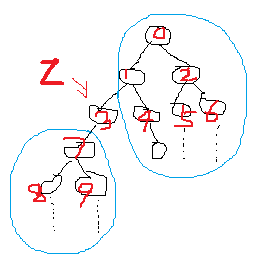
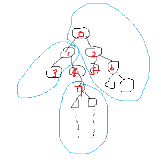
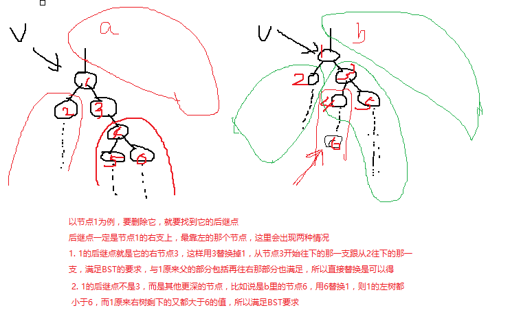

# 12.二叉搜索树（binary search tree BST）

一颗二叉树，如果对于每一个节点，其左边的节点树上的值都比它小（**包括等于的情况吗？不过一般遇到的问题都是不管等于这种情况的**）,并且其右边的节点数上的值都比它大，这就是一颗二叉搜索树。

> 大部分表述中将等于的情况去掉了，说树里面没有重复的值。没有的确会更简单一些,有也是可以构建出来树的,叫带重复关键字的二叉搜索树,这里的讨论都排除有重复的值吧。

对于一堆数据，可以有很多种不同的二叉搜索树的表示，但是应该尽量让其**高度小一些，左右子树均衡一些**，处理起来才更有效。

二叉搜索树，它内部的任一个节点的树都满足二叉搜索树的要求。

## 二叉搜索树的中序遍历（inorder tree walk）

中序遍历，就是在遍历一棵树时，遇到一个节点，先去遍历输出它的左子树，然后输出节点，再去遍历输出右子树，这样的结果就是将一颗二叉搜索树按照从小到大的顺序，有序的输出。

```js
// 伪代码
function inorder_tree_walk(root) {
  if (root == nil) {
    return
  }

  inorder_tree_walk(root.left)
  print(root)
  inorder_tree_walk(root.right)
}
```

## BST中最大和最小的节点

BST中值最小的节点就是最左边树的端点，最大的节点就是最右边树的端点。

```js
/**
* 伪代码
* @param tree 传入的参数是根节点，一棵树可以从根节点开始遍历出来，所以用一个根节点就可以表示一棵树。
* @returns {*}
*/
function findMin(tree) {
    if (!tree) {
        return null;
    }
    if (!tree.left) {
        return tree;
    } 
    return findMin(tree.left);
}
```
```js
function findMax(tree) {
    var current = tree;
    while(current && current.right) {
        current = current.right;
    }
    return current;
}
```

> 递归的好处是原理清晰，迭代的好处是性能好。递归需要大量的额外空间构建程序执行栈

## 查询二叉搜索树

就是给定一棵二叉搜索树，和一个值，查一下这个值是不是在这个树上

```js
// 传入的树，必须是棵二叉搜索树才可以。所以其实问题最关键的是如何构建一棵二叉搜索树
function tree_search(root, value) {
  if (root == nil) {  // 如果没有一颗真的树，那当然就找不到了
    return nil
  }
  if (root.value == value) {  // 如果直接相等，那就直接返回这个节点就可以了。
    return root
  } else if (root.value < value) {  // 如果root的值比查找的值小，那么就要去root的右树上找
    tree_search(root.right, value)
  } else {  // 如果root的值比查找的值大，那么就要去root的左树上找
    tree_search(root.left, value)
  }
}
```

上面是不断递归的方式，下面也可以用迭代去做

```js
function iterative_tree_search(root, value) {
  while(root != nil &&　root.value != value) {
    if (root.value < value ) {
      root = root.right
    } else {
      root = root.left
    }
  }
  return root
}
```

## 前驱和后继

节点的后继，就是在二叉搜索树中，比节点x的值大，但是又最靠近它的下一个

节点的前驱，就是比节点x的值小，但是又最靠近它的前一个

### 后继

#### 分析

**假设节点x有右树**

节点x要么是x.parent的左节点，要么是x.parent的右节点，要么既不是左也不是右，就这3种情况。如果既不是左也不是右，那x就只能是根节点。

如果x是根节点，那x的后继一定出现在它的右树上，并且是它右树上最小的节点。

如果x是它父节点的左节点，同时x还有右树。既然是父节点的左节点，那父节点的值一定比x自己和x的右节点树都大，也就是目前后继只能出现在x的右树上。那么此时可不可能后继出现在其他地方呢？其实是不可能的。假设此时x的父节点是x的祖父节点的左树，那么x的祖父节点和祖父节点的右树都比x和x的右树大，那么后继只能出现在x的右树上。如果此时x的父节点是x的祖父节点的右树，那么x和x的右树都比x的祖父节点和祖父节点的左树大，也不是后继出现的地方。在往上推，一层层推上去，会发现，更高的父辈节点，要么比x和x的右树大，要么比x和x的右树小。如果是比x和x的右树大，因为后继是比x大但又最接近x的，那应该出现在x的右树上。如果比x和x的右树小，后继要比x大，所以也只能出现在x的右树上。所以**如果x是父节点的左节点，同时x有右树，那后继节点只能出现在x的右树上**

同理，如果x是它父节点的右节点，同时x还有右树，也能分析出在这种条件下，**x的后继也出现在它的右树上**

综合目前的分析，如果节点有右树，那么就从节点右树上找到最小节点就是节点的后继。`findMin`

**假如节点x没有右树**

这种情况下，x要么只有左节点树，要么没有左节点树。但是不管有没有，因为是后继，都不可能从左子节点树上找，所以也就不用针对有没有左节点树来分析了。

节点x没有右树，那寻找后继的趋势就是在整棵树上往比它更右一些的节点里找。

1. 如果节点x没有父节点，一棵树里只有根节点没有父节点，所以x就是根节点。而x还没有右树，那对不起，真的找不到x的后继。

2. 如果节点x有父节点

  a. 如果x是父节点的左节点，那很好了，这个父节点肯定比x值大，同时父节点是最临近x的节点了，此时这个父节点就是后继。
  b. 如果x是父节点的右节点，那x比父节点大，不满足后继的要求，此时就要顺着路线往上找，一直找到一个父辈节点y，y是y.parent的左节点，那么此时x就是在y.parent这个节点的左树上，y.parent就是x的后继。


```js
// 伪代码
function tree_successor(x) {
  if (x.right != nil) {
    return tree_minimum(x.right)
  } else {
    while(true) {
      y = x.parent
      if (y == nil) {
        return nil  // 对不起那真的找不到
      }

      if (x == y.right) {
        x = y
        y = y.parent
      } else if (x == y.left) {  // 找到了
        return y
      }
    }
    
  }
}

function anotherWay(x) {
  if (x.right != nil) {
    return tree_minium(x.right)
  } else {
    var y = x
    while(y.parent) {
      if (y == y.parent.left) {
        break
      }
      y = y.parent
    }
    return y
  }
}
```

```js
function tree_minimum(x) {
  var node = x
  while(node != nil) {
    node = node.left
  }
  return node
}
```

```js
function tree_maxmium(x) {
  var node = x
  while(node != nil) {
    node = node.right
  }
  return node
}
```

## 二叉搜索树插入和删除

### 插入

```js
将一个新的节点 v，插入到一棵二叉搜索树 T 中

1.如果 T是空树，那就直接指向新节点就行。
T.root = V
2.如果 T不是空树
x = T.root
while(x != nil) {
  y = x
  if (x.value > v.value) {  //去x的左支找
    x = x.left
  } else {  // 去找x的右支
    x = x.right
  }
}

// 最后跳出while时，x就是nil，而y指向最后一次比较的节点，那接下来就是比较节点 y的值跟节点 v的值

v.parent = y
if (y.value > v.value) { // y的值比v的值大，那v就是y的左子
  y.left = v
} else {  // v是 y的右子
  y.right = v
}
```

### 删除

从一棵二叉搜索树 T 中删除一个节点 v。这个问题稍微复杂些，要考虑不同情况：

1. 如果树是空的，那直接返回，这种情况没意思，从空树里删节点，不需要考虑了
2. 如果节点 v 没有左节点和右节点，那么就直接删掉 v 就行。只要更改 v的父节点的节点指向就行

```js
// 查出父节点，更新父节点的指针
if (v.left == nil && v.right == nil) {
  parent = v.parent
  if (parent == nil) {  // v就是根节点了
    root = nil // 把根节点删掉，树就空了
  } else {
    if (parent.left == v) { // v是父亲的左儿子
      parent.left = nil
    } else {  //v是父亲的右儿子
      parent.right = nil
    }
  }
}
```

3. 如果节点 `v` 有左儿子，但是没有右儿子，以下图 `3` 号节点为例。`3` 的左树和右边部分之间是满足二叉搜索树的条件的，移除 `3` 后，只要用 `3` 的左儿子7来代替 `3` 的位置就可以了


```js
if (v.left != nil && v.right == nil) {
  left = v.left
  parent = v.parent
  if (parent == nil) { // v是根节点
    left.parent = nil
    root = v.left
  } else {
    left.parent = parent
    parent.left = left
  }
}
```


4. 如果节点 `v` 有右儿子，但是没有左儿子.以下图节点 `4` 为例。其父节点剩下的其他节点和整个树的右边部分再加上它右儿子树，整体都满足二叉搜索树的条件，只要将 `v` 的右儿子替换v就可以了

```js

if (v.left == nil && v.right != nil) {
  parent = v.parent
  right = v.right
  if (parent == nil) { // 跟上面情况类似，这里不写了
    .....
  } else {
    right.parent = parent
    if (v is parent.left) {
      parent.left  = right
    } else {
      parent.right = right
    }
  }
}
```


情况 `3` 和 `4` 可以总结为一种情况，就是要删除的节点只有一个子树，左或者右，删除后直接用其子树替换自己就可以了。

5. 如果v既有左儿子又有右儿子，那就麻烦一点了。看下图解释



上面的删除说的有点复杂，在`./index.html`里写了个更明显易懂的方式：`deleteX`，传入两个参数，树的根节点和要删除的节点的值。【为了易懂，代码写的复杂了】

总结上面的情况，整个删除方法执行的步骤：
1. 先在树中查找`x`的位置，如果查不到，那就说明这个节点根本不存在，直接返回，否则执行第2步
2. 如果查找到的节点没有左树也没有右树，就自己一个光杆司令，那就直接删除它，清空一些原本的关系(指针)
3. 如果节点没有左树，但有右树，删除它，然后让它的右树坐它的位置。
4. 如果节点有左树，没有右树，删除它，然后让它的左树坐它的位置。
5. 如果节点又有左树，又有右树，这种情况下可以有两种做法，可以让它左树最大节点坐自己的位置，也可以让右树最小节点坐。这里以**左树最大节点**为例
    a. 通过`findMax(xNode.left)`在`xNode.left`上找出最大的节点，这个最大的节点一定逃不出**两种**情况：要么它没有子节点了，要么它只有左子节点，
因为如果有右节点，那这个右节点的值就会比它大，它也就不是最大节点了。
    b. 找出最大左子节点之后，调用`deleteX(xNode.left, maxNode.value)`把这个`maxNode`从`xNode.left`上删掉，然后让`maxNode`坐自己的位置，
更新各种关系

> 要注意对于`xNode.parent`的处理


## 如何构建一棵二叉搜索树

有一个简单方法：一个数组A，构建一个对应的二叉搜索树，其实只要每次从数组里拿出一个数字，然后调用二叉搜索树的插入就可以最后得到一个二叉搜索树。

但是这样构建的树性能怎么样？尽量分散了吗？不好说。
比如，一个已经排好序的数组，按照这方法，最后的树就是一根直溜溜的往左或者往右了，树的高度就是
A.length-1,但这样的树明显不好。

对于一个元素出现随机的数组，效果应该还行。但是对于排序好的数组，那就完蛋。对于排序好的数组，是不是可以每次随机一个索引，然后拿索引对应的值插入呢？
