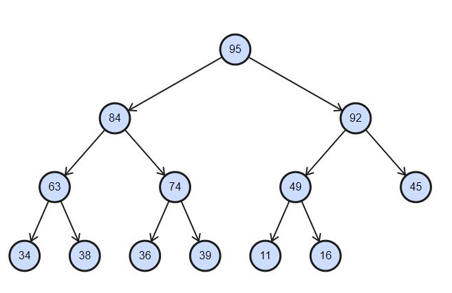

# 优先队列和堆

跟堆排序有很多内容是补充的，要参考那里去看。

## 最大堆和最小堆

首先它要是一棵**完全二叉树**，然后对于这棵树上所有的节点x，如果x都是它的子树中值最大的节点，按照这个要求获得的二叉树就叫做**最大堆**，如果x都是它的子树中值最小的节点，按照这个要求获得的二叉树就叫做**最小堆**

> 注意:最大堆和最小堆要求是完全二叉树，只是尽量排满左边的节点。它不是二叉搜索树。

上图中就是一个最大堆的例子，圆圈内的数字表示该节点的值。图中任意一个节点，它始终是比它的子树上的所有节点的值都大。

## 操作【以最大堆为例】

### 插入 insert

给定一棵最大堆的树，然后插入新的节点，要求新树仍然满足最大堆的要求

### 删除 delete

给定一棵最大堆的树，然后删除最大的节点，要求剩下的节点数仍然满足最大堆的要求。

1. 把根节点删除
2. 从原来的树中找出最后的节点，让这个节点做根节点的位置。这是为了仍然保持完全二叉树的要求
3. 将提升上来的节点跟左右两棵树比较，如果满足最大堆要求就退出（八成是不满足的，因为是从底下拿上来的，肯定比上面的值小）。如果不满足，从左右的子节点里找出最大的，跟它互换位置。
4. 重复执行3中的比较，直到把这个节点放到合适的位置

### 创建 create

给定一个数组，创建对应的最大堆的树

最直接的想法：

每次从数组里拿出一个数，往已构建好的树里做**插入**操作，最后就是棵最大堆的树。但这种方法并不是最好的方法

理论依据: 一开始是空树，加入一个数后肯定满足最大堆要求。然后再拿出一个数，做插入操作，最后的结果又是一棵最大堆的树。然后再拿再插入直到全部插进去。每次插入之前，树已经满足最大堆要求，插入之后我们仍然确保满足最大堆要求，那么最后就完成一棵最大堆的树。

- 很多算法和结构都是从小范围内开始构建，然后最后蔓延到全部。

一般的方法：

1. 把数组元素按照顺序构建一棵完全二叉树。
2. 找出最后一个非叶子节点。因为是非叶子节点，所以该节点肯定有子节点，而且要么是左右两个节点，要么是一个左节点。从子节点中找出最大的节点，然后跟该节点比较，如果满足大小的关系那就不用改动这几个节点，继续往上检测其他的非叶子节点。如果不满足大小关系，那就互换该节点和子节点，然后沿着节点树，依次往下比较，如果有不满足大小关系的节点，继续互换。

    这种方法里其实跟最直接的想法是有相通的地方。就是从最小支开始，一点一点去凑一棵树，最后让所有的节点都满足条件，成为一颗完整的树。
