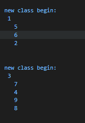

# 等价关系

啥叫等价关系？等价关系叫等价关系，生活中的等价的概念就很明了，不过要用数学语言来描述。

啥叫等价类？一个关系的集合`R`，对于它里面所表示的各条等价关系，从中找出相互等价的所有元素，这些元素组成的集合就叫做等价类。

举个例子：关系集合`R`里有这些等价关系：`(a,b), (b,c), (c,d), (e,f), (f,g)`，那么这个集合`R`里可以得出两个等价类`{a,b,c,d}`和`{e,f,g}`，每个元素都在里面，并且每个等价类都包含了所有属于它的元素了

## 离线等价类

给定n个元素和描述他们之间等价关系的集合R，将n个元素所有的等价类都找出来，就像上面的例子那样，最终能得到2个等价类。离线等价类问题就是研究如何确定所有的等价类的问题。

**union-find.js**



## 在线等价类

就是并查集问题。并查集简单说就是找朋友，把所有的人分成几组，每组内的人都是朋友。一个人不能同时在两个组里。或者组团打架，别打到自己人

```js
function init(n) {
  var arr = []
  for(var i = 0; i<n;i++) {
    arr[i] = i;
  }
}
```

`init`方法对`n`个元素进行了初始化。`n`个元素分别编号`0，1，2，，，n-1`，初始时让每个人都认自己当大哥。这时候每个人都是一个独立的组。**用arr[i]表示i元素它的老大的编号**

```js
function union(i,j) {
  var x = find(i) // find 找老大
  var y = find(j)
  if (x == y) {
    // 同一个老大，啥也不用做了
  } else {
    // 不一个老大，那就帮派不一样，老大们之间重新认老大吧
    arr[x] = y // arr[y] = x 也行，没关系的。
  }
}
```

`union`对`i`和`j`进行联合，让他们成为一组。找出他们各自的老大，如果老大是同一个，那就说明他们在一个组里，已经联合了。如果老大不是同一个，就让他们一个的老大拜另一个的老大当老大，这样他们又是一个老大了，就又都在一个组里了。【可以这么做是因为关注的点是判断他们在不在一个组，而不管在这个组里是第几层的小弟。】

```js
function find(x) {
  var r = x;
  while(arr[r] != r) {
    r = arr[r];
  }
  return r;
}
```

`find`找`x`这支上的老大，老大的特点是**老大的老大是自己**

以上就是最简单的并查集的方法。

上面的`union`方法中，在将两个不一伙的人合到一起时，只是简单的将他们的老大串起来了，这样很有可能造成一种结果，那就是最后形成的树很深，而且有可能恶化成一条链表，原本与树有关的查找效率一般跟树的高度（深度）有关，现在这棵树很高（深），那效率就一般般了。

优化的方式有两种:

一是在`union`合并时，不再简单粗暴，而是根据一定的规则合并，这里用到重量或者深度规则，但是有点变种的意思，英文称`union by size`和`union by rank`。

1. union by rank
   
初始化时，每个元素都是一个单独的树，他们的`rank`都是`0`。当合并两个`classA`和`classB`时，如果`classA.rank < classB.rank`，就把`classA`变成`classB`的小弟（谁`rank`值大，谁就是新老大），合并之后，`classB`的`rank`不变。如果两个`rank`值一样，合并后，让新的老大的`rank+1`。这有点类似按照高度合并，矮的合到高的上，不影响新的高度。**两个一样高，合在一起后，高度+1**。这里不用`height`而用的`rank`，是因为在`find`的过程中，如果使用优化后的方法，会导致树的高度发生很大的变化，而我们无法及时的更改树的高度，所以用`rank`。这种优化方法只是从大面上说优化，不能具体针对某个具体的例子，而且说不定到某具体例子上反而失效了。

2. union by size

记录每棵树的节点总数，合并时，将节点数小的合到节点数大的上，并更新节点数

二是在`find`的过程中，因为会遍历从节点`x`到根这条路径上的所有点，对他们之间的`parent`指针进行调整，这样虽然此次并不能提高效率，相反还降低效率了，但提高了之后的查找效率。

调整`parent`指针的方式有三种：

1. path  compression

从节点`x`开始到根节点这条路径上所有的点，执行`find`后会找出最终的根节点`r`，然后让这条路径上的所有点的`parent`直接指向`r`，这样明显降低了这根枝的高度（枝也是棵树），后续执行`find`找这棵枝上的节点的老大时的速度就快了

```js
function find(x) {
  // 老大的老大都是自己。这个判断谁是老大的标准可以自己定，也可以谁没有老大谁就是老大。谁老大是-1，谁就是老大
  let root = x;
  while(root.parent != root) { 
    root = root.parent;
  }
  // 上面这个while循环执行完后，就能找到x这枝的老大了，但我们不急着返回root，而是对这一枝上的节点进行一下处理
  let tar = x;
  let next;
  while(tar.parent != root) {
    next = tar.parent;
    tar.parent = root;
    tar = next;
  }

  return root;
}
```

2. path halving

还是上面那条路径上的节点，从节点`x`开始，从下往上，每隔一个节点，就让它的`parent`直接指向它的`grand parent`，这样也能缩短一半的路径

```js
function find(x) {
  // find root code here

  let tar = x;
  while(tar.parent != root) {
    tar.parent = tar.parent.parent;
    tar = tar.parent;
  }

  return root;
}
```

3. path spliting

还是上面的路径上的节点，从`x`开始，每个节点的`parent`指向它的`grand parent`，这样查找根节点时就能减少些遍历

```js
function find(x) {
  // 找root的代码这里就不重复了，跟上面是一样的

  let tar = x;
  let next;
  while(tar.parent != root) {
    next = tar.parent;
    tar.parent = tar.parent.parent;
    tar = next;
  }

  return root；
}
```


`path halving`和`path spliting`有点类似的，一个是所有节点都`parent->grand parent`，一个是每隔一个节点`parent->grand parent`


