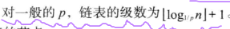

# 跳表

## 参考：

http://zhangtielei.com/posts/blog-redis-skiplist.html

https://lotabout.me/2018/skip-list/

《数据结构，算法和应用（第二版）》

## 是干嘛的？

在有序数组里查找元素可以用二分法，减少比对的次数，提高效率。同样，如果在有序链表里，构建类似的机制，使得查找时可以二分查找，也能减少次数，提高效率。但有序链表的内存空间不是连续的，无法用简单的公式来确定序号，所以要增加额外的标记，所以空间复杂度会上升。

原本有序表添加个头结点和尾节点，一个节点通过指针指向临近的下一个节点，这叫0级链表。往上等级链表，节点与下一节点间相隔的节点数增多，尽量按照2的倍数来增加，构建完后，最顶上一级就会是`head->mid->tail`，这样看，很像有序数组的二分查找。


这个图很清晰的说明了，从下往上，一开始是一个接一个，然后2个数连起来，然后4个数连起来，然后是8个数。这只是一种方式，并不刻意要求一定满足这样，比如最顶层`head->21->tail`，完全也可以是`head->17->tail`或者其他的，这不影响理论的效果（当然针对某次的查找可能会影响查找的次数），而且对于每一层并不要求一致都这样。当然最低那一层肯定是一个接着一个。


**跳表是用来快速查找元素的。**

很多地方都说在跳表里，上下两层链表中记录的个数或者节点的个数严格满足`2:1`的关系，这就是胡说八道，这个严格的关系只在某些层级之间会出现，从整体来说，它是满足大致为`2:1`的关系。


## 说明：

##### 对书中例子`10-1c`的解释：

首先用`2级`链表查找，找的是什么？其实这里是`2级`链表开始，换成通用的概念，就是从**最高级链表**开始查找，这个最高级链表将整个链表的元素分为了左右两部分，从`head`开始，直接访问`head->next`,(因为`head`是假的节点，不存在比较的意义)所以就直接查找到了`40`这个节点，那这就是`O(1)`。找到后，将`30`和`40`进行比较，确定了要在左半边继续找。那就是找下一级链表的里，`head.next`,这次找到了`24`，也是`O(1)`.`30>24`，所以要在下一级继续找，这次找`24`的右边，直接找到了`24.next`，这里还是个`O(1)`,这是找到了`30`了。如果在这级还没找打，那就继续找，但是此时级别已经用空了，所以就跳出循环了，在链表里找不到要找的元素

##### **链表的级别`i`是从`0`开始计算的**

##### 把新数对插入`i`级链表的概率是`p^i`。这个怎么理解呢？

有一个概念，叫**数对属于`i`级链表**，是说该数对在`0-i`级链表里都有，观察图示也可以发现这样的规律。一个数对是不可以在某一层链表`x`，然后在`x`之下的某层里(`x-1`,`x-2`...这样的层级，因为这样会造成查询是丢失判断)又不存在。理解这一模式后，假定数对在`x`级链表里，并且在`x+1`级链表里的概率是`p`，对于第`0`级，肯定都在，则概率是`1`。对于第`1`级，某一节点在第`1`级的概率就是`p^1`。依次类推，在第`2`级的概率是`p^2`.

##### 对一般的有序链表，对于一般的概率`p`,链表的级数的计算：



明确几点，链表总共`n`个数对（`head`和`tail`不算的），级数是从`0`开始算的，一层的节点会在下一层的概率是`p`，最后一级的链表形如`head->node->tail`，也就是在最后一级的链表里，只有`1`个节点在，那就有公式`n * p ^ i = 1`。

```
1. n * p ^ i = 1
2. n / (1/p) ^ i = 1
3. (1/p) ^ i = n
4. i = Log(1/p)[n]
```

这是纯数据计算，得到的`i`值很可能是小数，但是这里是计算层级，明显层级是整数，所以要调整一下。

假设`i`计算后是个整数，因为级数是从`0`开始算的，所以级数应该是`i+1`，此时可以写成对`Log(1/p)[n]`向下取整后加`1`
如果`i`计算后带有小数，同样的，满足对`Log(1/p)[n]`向下取整后加`1`，

**但这样的计算也是有缺点的，具体如书上所讲**


## 都有哪些操作？

查找，插入，删除。构建也是插入，从零开始慢慢构建。
