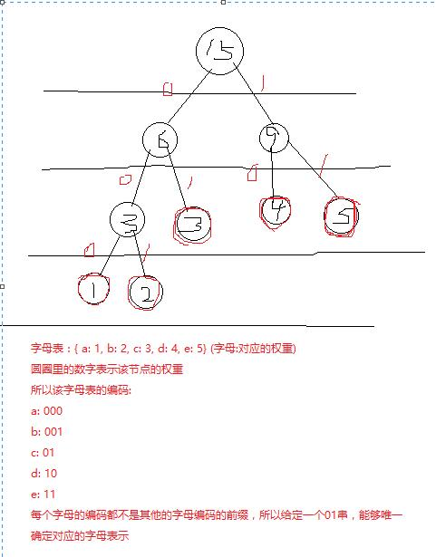
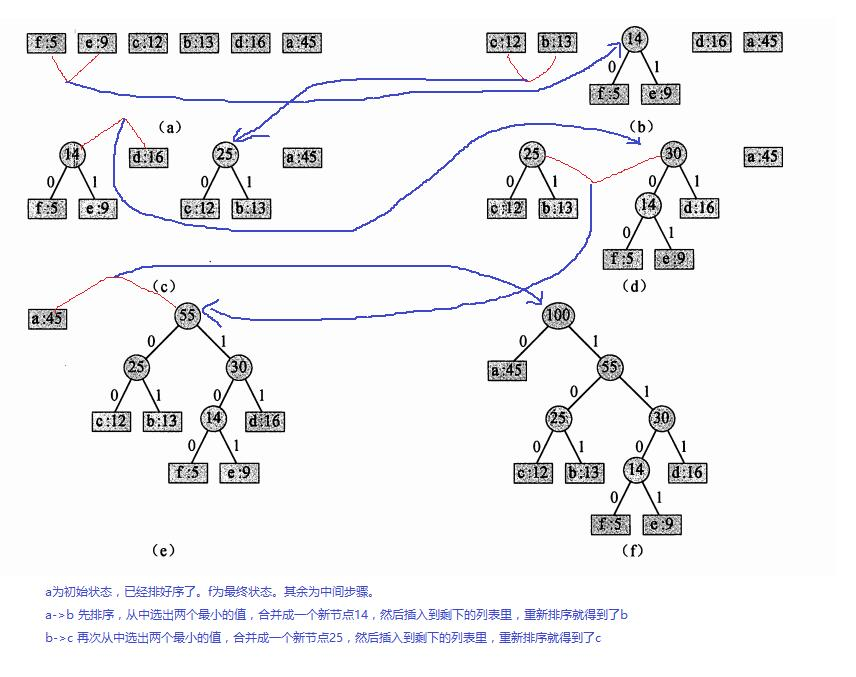

# 霍夫曼树和霍夫曼编码

## 定义

对于一棵二叉树，它的所有的叶子节点都有一个权重 `w` ，每个叶子节点的深度是 `l` ，每个叶子结点对应的代价 `c = w * l`，这棵树的所有叶子节点的总的代价为 `C`， `C`叫做带权路径长度。霍夫曼树就是 `C` 的值最小的树，也叫最优二叉树。

## 操作

给定一个字母表的集合，每个字母都有对应的权重，构建一棵霍夫曼树。

1. 先按照字母的权重构建一棵**最小堆**的树。
2. 构建一个空的节点 node ，从这棵最小堆的树里取出一个根 node1 （取出后当然要保持继续是最小堆），令 node.left = node1, 然后再取出一个根 node2，令 node.right = node2, 令 node.weight = node1.weight + node2.weight, 然后将这个新的节点插入到剩下的最小堆（同样的，依然要保证插入后是最小堆）。
3. 重复执行第2步，直到树中只剩下一个节点。这个节点就是对应的霍夫曼树的根节点，从这个节点开始可以写出整棵霍夫曼树
4. 从根节点开始，如果往左分支了就写个0，如果往右分支了就写个1，将字母表里的字母对应的路径上的所有0和1整合在一起就是该字母的编码，叫霍夫曼编码

> 针对这里的算法描述，每步操作后都仍然是一棵最小堆树，那其实就是每次操作之后都在原来基础上按照从小到大的顺序排序而已，中间的具体排序可以任意选择。当然选择的排序算法越好，整个的效率也越好。


给定一棵霍夫曼树，以任意一个非叶子节点，左右互换子树，结果仍然是一棵霍夫曼树。因为左右交换只改变了路径上的 0 1 编码，并没有改变字母表中每个字母在树中的深度以及字母的权重，按照公式，整棵树的带权路径依然是不变的。

伪代码表示：

给定一个字母表 C， 其字母数量为 n , 最后返回的节点就是构建好的霍夫曼树的根节点

```js

Q = make_min_heap(C) // 以字母表C为基准，构建一棵对应的最小堆树

for i=1 to n-1
  z = new Node()
  z.left = min_heap_delete(Q)
  z.right = min_heap_delete(Q)
  z.weight = z.left.weight + z.right.weight
  min_heap_insert(Q, z)

return min_heap_delete(Q)
```

> 上面采用了 for 循环，其实这个构建过程的总的步数是个固定的：字母数量为n，则n-1次循环之后就会构建好树。

下面是霍夫曼编码的例子：




## 应用

### 压缩字符串编码

## links
[霍夫曼编码-维基百科](https://zh.wikipedia.org/wiki/%E9%9C%8D%E5%A4%AB%E6%9B%BC%E7%BC%96%E7%A0%81)
[Huffman coding](http://homes.sice.indiana.edu/yye/lab/teaching/spring2014-C343/huffman.php)
[A quick tutorial on generating a huffman tree](https://www.siggraph.org/education/materials/HyperGraph/video/mpeg/mpegfaq/huffman_tutorial.html)