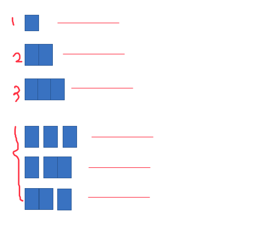

# 动态规划

## 钢条切割问题

最后的简化算法是：从左边切下一块长度为 i 的钢条，直接根据价格表得出收益 p(i)，然后剩下的长度为 n-i 的钢条用 r(n-i)表示它的最大收益。那么钢条的收益方案就变成了 p(1)+r(n-1), p(2)+r(n-2),,,, p(n)+r(n-n)这么多种，求最大收益就是求这些方案对应的收益的最大值，对这些收益执行 max 操作即可。

在这里，我们固定左边切下的钢条，直接按照价格表对应的值得出其收益。右边的我们只是写作r(n-i),并没有过多的关注这块钢条再具体的切割方案。这样的考虑方法真的能覆盖所有的可能性吗？

其实可以的。

在下面的图中，上半部分是按照简化算法来切割的钢条。其中针对左边为3的情况，如果算最佳收益，我们应该分析所有的情况：即左边为3可以有4种分法，在这4种分法下分别求出对应的最佳收益，然后比较之后得出左边为3的最佳收益。但仔细看，下半部分拆出来的3种分法，其实都能合并在之前的分法中。前两种就合并到左边为1时的收益计算中。最后一种就合并到左边为2的收益中。依此类推，看左边4块，5块。。。下最佳收益，其实左边这部分就不用拆开了，因为拆开的那种分法的收益已经在之前就计算过了。所以这种简化算法是对的。

