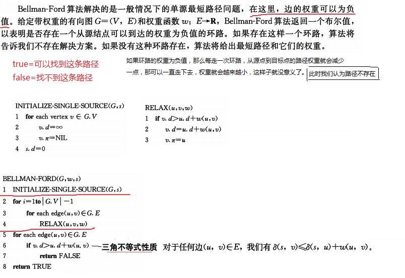
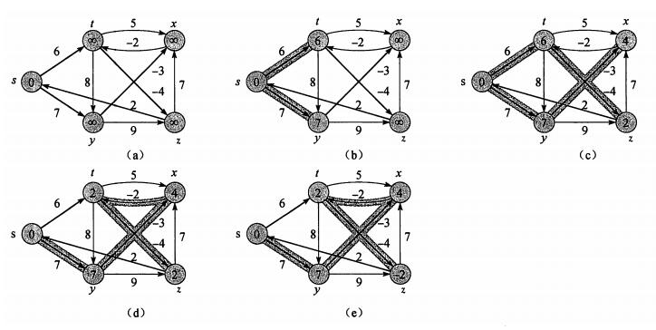

# 最短路径问题

## 单源最短路径问题

给定一个图 G = (V, E),找出从给定的顶点 s 出发到其他顶点的最短路径。

顶点 s 到顶点 v 的最短路径是指在从 s 到 v 的所有路径中，路径的权重和最小的那条路径。

> 最短路径不一定是唯一的，可以有多条。

> 对于最短路径上经过的点，这些点之间的这部分路径，也是这些点之间的一条最短路径。

> 权重只是个衡量值，可以是很多有具体意义的值，比如花费的钱、经过的路程、消耗的时间等。

### Bellman-Ford 算法

**节点的前继节点用 π 表示实在是难理解，可以直接用 parent 代替**

算法第 1 行先对所有的点进行设置。此时还没有找路径，所以每个点它的路径的权重都是**无穷大**。前继节点也是 null，因为还没找啊。

> 前继节点类似父节点，因为算法最后找到的最短路径，其实不是一条路径，而是一个最短路径的树：树的根节点就是源节点，表示从源节点出发。树中其他的节点表示从根节点可以到达的节点，而树中的边就是图中边。给定一个顶点，在这个树上找到它，然后从源点出发，沿着树走，经过的点和边就构成源点和目标点之间的最短路径。

算法第 5-8 行是对遍历结果进行验证，判断是否能找到合适的最短路径，也就是排除某条路径中出现部分权重和为负值的环路。一旦有几条边构成了权重和为负值的环路，那么只要沿着这个环路走下去，权重和就会一直变小，那就陷入了死循环，对最短路径问题也就没啥意义了，所以此时我们认为找不到最短路径。

> 判断的依据是三角不等式性质。这个性质也很好证明，采用反证法。假设给定一个图 G 和源点 s，已经计算好最短路径。对于任意节点 u 和 v，v.d > u.d + w(u,v)。假设这个结论成立，那么说明有一条从 s 先到 u 然后从 u 到 v 的路径，这条路径的权重比已经计算出来的 v.d 还小，那到 v 的最短路径应该是经过 u 到达 v，而不是当前 v 的那条最短路径，这与最短路径定义矛盾。

RELAX 操作是说，对于 v 的权重和 v.d，假如有一条路径，它经过点 u，然后从 u 到达 v，这条路径的权重和为 u.d+w(u,v),如果 v.d > u.d + w(u,v)，说明可以找一条到 v 的更短的路径，所以更新 v.d 和 v.parent。

第 2-4 行遍历执行 RELAX 操作。这里有一点很重要：比如遍历时候遇到一条边(u,v)，在判断 v.d 和 u.d，w(u,v)的时候发现此时 u.d 还没明确计算出值来，那怎么比较，无穷大跟无穷大比？放心，此时无穷大跟无穷大比，是不会满足大于的关系的，也就不会走入那个 if 判断内部。

#### Bellman-Ford 的例子

图中 a 是初始状态。

根据算法 3-4，`for each edge (u,v) { RELAX(u,v,w) }`，遍历这些边的时候是没有确定的顺序的，比如用邻接表来表示这个图，可以写`s->t->y,t->x->z->y......`,这样遍历是比较的边就是`st,sy,tx,tz,ty...`。如果写`x->t,y->z->x，s->t->y,....`，那遍历时候边的顺序就是`xt,yz,yx，st,sy,....`.一种写法一种遍历的顺序。

第 2 行`for i=1 to n-1`的循环，其实进行第 1 遍时，很多的边之间的 `RELAX` 操作，都遇到了无穷大比较，这时候不会进入 `if` 判断，但是一整遍遍历中，会遇到 `RELAX(s,t)`和 `RELAX(s,y)`,以 `RELAX(s,t)`为例，此时 `RELAX` 操作要判断 `t.d > s.d + w(s,t)`,`t.d` 为无穷大，`s.d=0，w(s,t)=6`,所以这次可以更新`s`和 `t` 之间的了，`t.d = w(s,t),t.parent = s`。`i=2`,下一次循环的时候,如果遇到 `RELAX(t,x)`那此时也就有法进行判断了。其实说白了，从第 1 次循环，先计算跟源点 s 相连的节点，第 2 次循环，计算跟上次结果中的节点相连的节点，一次次地循环都在前面循环的基础上去构建最终结果。从`i=1`开始，把每次的比较写出来就很显然了.。所以例子中 b 图就是 `i=1` 遍历之后得出的目前的结果，c 是 `i=2` 遍历后得出的目前的结果。。
